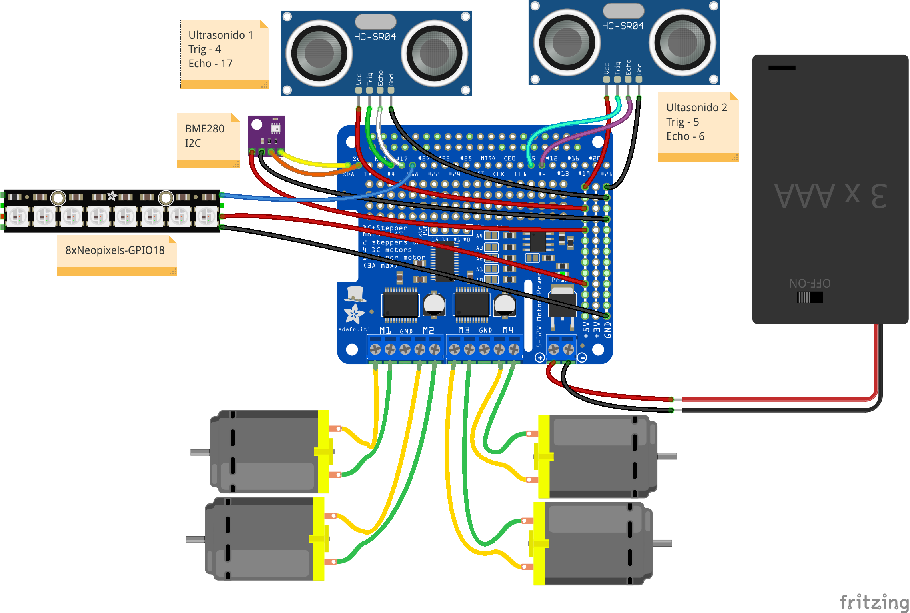

# raspiCar

Robot móvil controlado con una Raspberry

Programación en python
Podemos controlarlo con una webApp desarrollado en Flask
Bot de telegram para acceder a los datos de funcionamiento

 CC by SA @javacasm

Julio 2020

